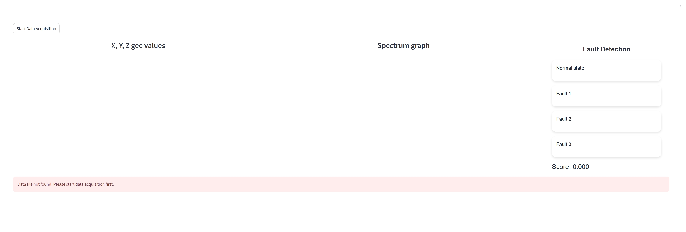

# Overview
This repo contains programs written in Python to show the GUI for stepping motor fault prediction application. In the backend code, 4 seconds of the ADXL382 accelerometer sensor time-series  data is acquired, then pre-processed into FFT data. This FFT data is fed into a pretrained CNN model for fault classification.
The time-series graph, FFT graph as well as the machine learning prediction are displayed on the GUI.
 
**Required hardwares:**
1. Raspberry Pi Pico
2. ADXL382 accelerometer attached on the stepping motor inside an infusion pump
   

**Software:**
1. The pretrained model *`best_model.keras`* found in folder *`model`* was trained on the data obtained from a specific stepping motor of the infusion pump. If you use a different motor with different set-up, you must re-train the model/create your own ML model.
   The code for data-processing, Ml model creation, evaluation can be found here. You can process your data and make your own ML model with the notebook template.
  [stepping_motor_fault_classification_model.ipynb](https://github.com/dauhoangganh/ADXL382_Pico_Streamlit_Example/blob/main/stepping_motor_fault_classification_model.ipynb)
2. Flash adxl382_spi.uf2 file to pico. The adxl382_spi.uf2 file can be found [here](https://github.com/dauhoangganh/ADXL382_SPI_raspberry_pico/blob/main/build/adxl382_spi.uf2)

# How to run main.py
1. Clone this repo to your local PC
2. cd to the directory containing main.py in your PC
3. Define SERIAL_PORT variable on line 27 of [main.py](https://github.com/dauhoangganh/ADXL382_Pico_Streamlit_Example/blob/main/main.py) to the actual COM PORT associated with Pico when Pico is connected to your PC
4. in the terminal, run *`pip install -r requirements.txt`*
5. In the terminal, run *`streamlit run main.py`*

# GUI explanation
After running *`streamlit run main.py`*, the following GUI will appear on your default browser

# Start data acquisition
1. Connect ADXL382 to Pico as described in this [README.md](https://github.com/dauhoangganh/ADXL382_SPI_raspberry_pico/blob/main/README.md)
2. Connect Pico to your PC
3. Click **Start Data Acquisition** button on the GUI
4. Wait until the data transfer from Pico completes

# Check the result
After the completion of serial data transfer, you will see the time-series graph, FFT graph and the motor fault prediction result displayed on the GUI.
You can use the slide bar to adjust the horizontal axis range of the graphs.
 
You can restart data acquisition by simply clicking **Start Data Acquisition** button on the GUI, no need to disconnect and reconnect Pico.
 
Time-series graph and FFT graph are automatically saved into [*`output_data`*](https://github.com/dauhoangganh/ADXL382_Pico_Streamlit_Example/tree/main/output_data) folder.
